1: **Install VS Code**

First, we need to download VS code. Just google it! After that, left click download. 
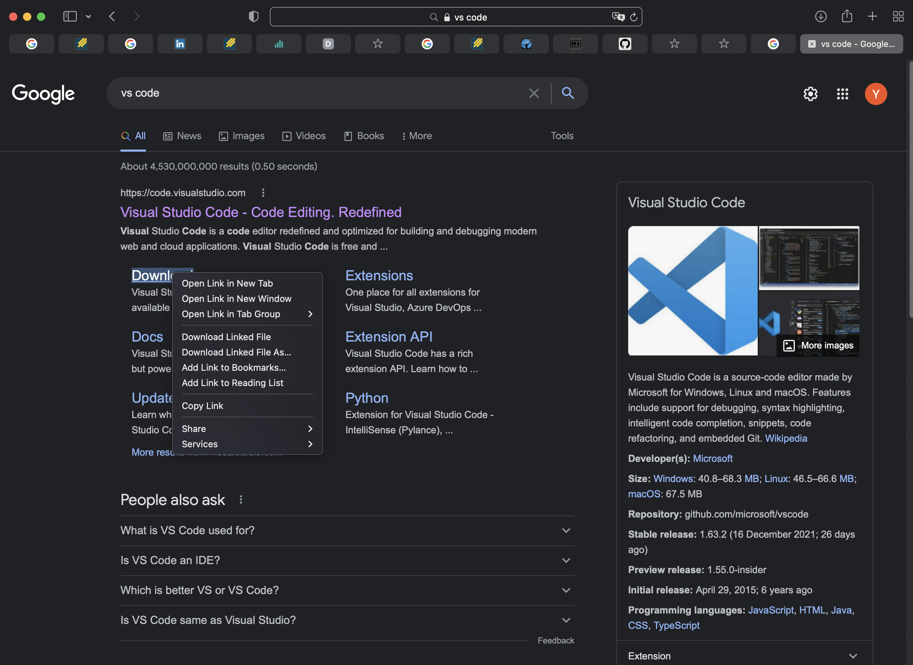
After that, you can select whichever option that fits your device, and click download button.
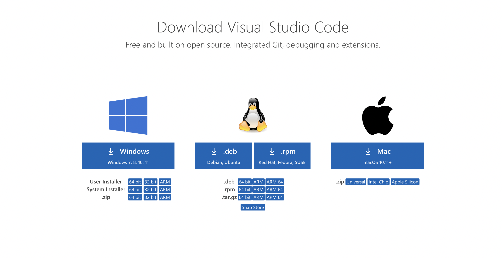
After that, we got the VS code installed!
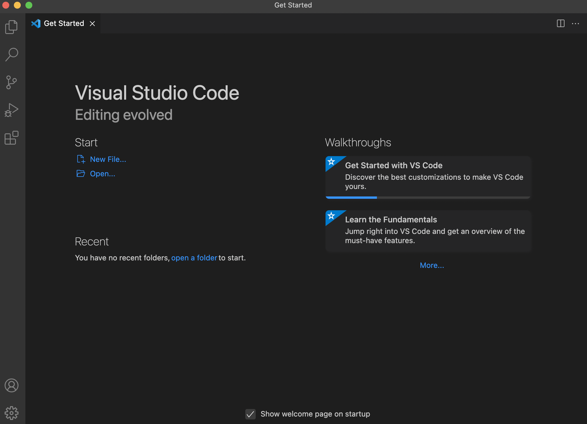

2: **Remotely Connecting**

Second, we should connect to the remote server.

Change the 3 letter before the @ symbol to the three letter in your personal account.

Then the password will pop out. Enter the corerrect password and then you will be logged in to your remote server.

*The complete display should look something like this once you enter your password and are logged in.*

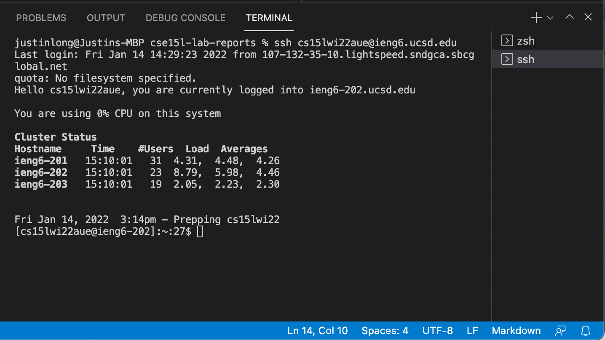

Notice that the username changes from my user name Justin to the school remote server name s15lwi22aue@ieng6, this means we're currently using the remote server.

3: **Run Some Commands**

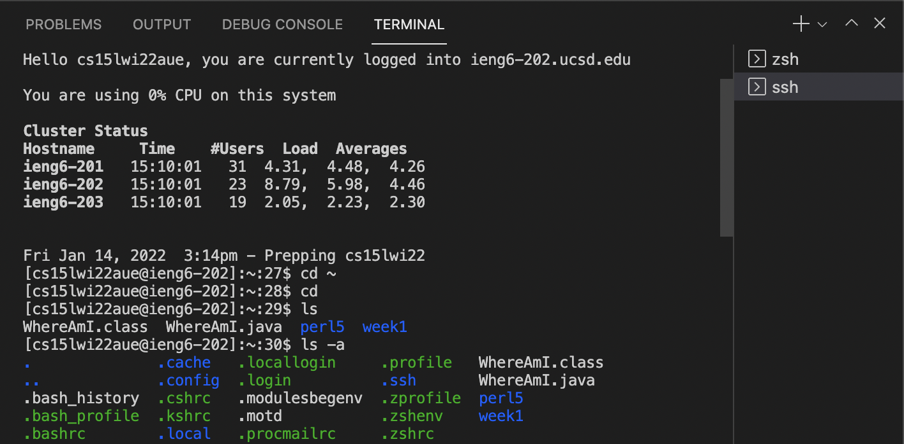

Here're some basic commands that we should know and memorize. 
```
> cd  &  cd ~
```
this two command allow us to change from current directory back to the main directory
```
> ls
```
this command is used to list all non-hidden files
```
> ls -a
```

this command is used to list all files, including hidden ones.

4: **Moving Files over SSH with scp**

Create a new file called WhereAmI.java in your computer.
You can do this by clicking the icon "new file" at top left corner.

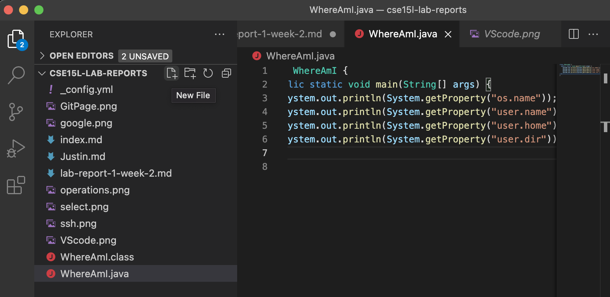

After that, paste all the provided code of WhereAmI.java into this newly created file, press Shift + S to save it.

After exiting the remote server, We can then run the file on our computer to see what it outputs.

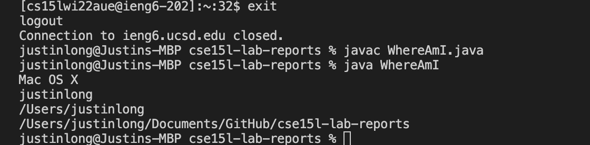

As we can see, the followings are print out:

> My system(MacOS), My usename(justinlong), Location of my User file, Current Working directory

let's try secure copy it to the remote server and run it on the server.

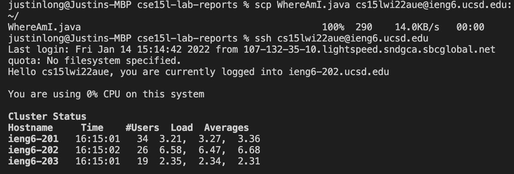
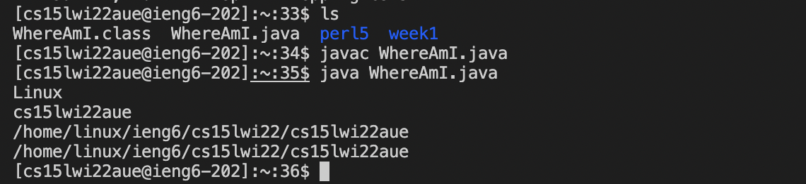

> Difference: Instead of MacOS, we found it ow running on Linux with the online account name as use name


5: **Setting an SSH key**
```
> ssh-keygen
```

To avoid entering password every single time.

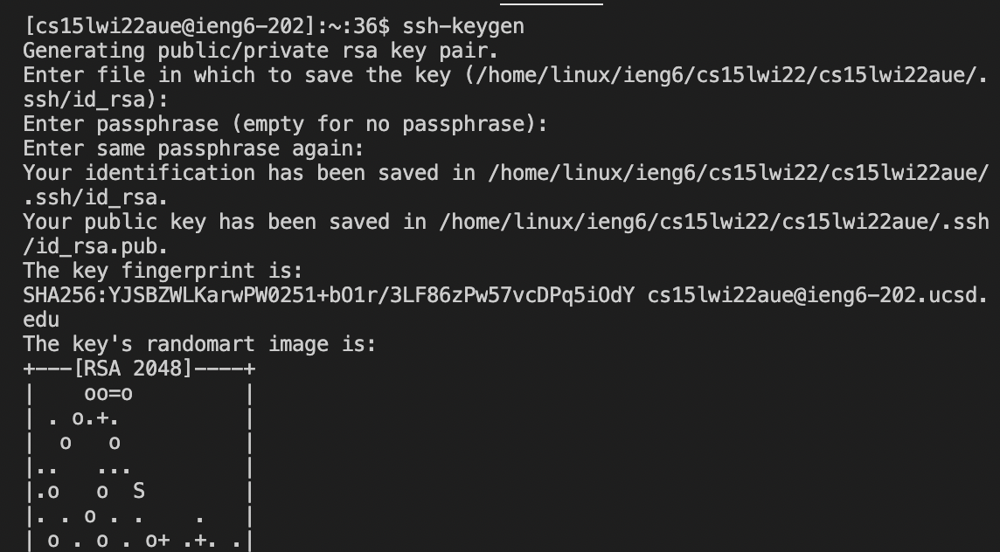
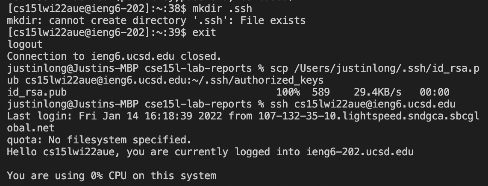

(Igonore the notice that "mkdir: cannot create directory '.ssh': File exists", this is because I alredy generated it once, and this is the second time for demonstration purpose)

> Now we can log in supper quickly without needing to enter password every time!

6: **Optimizing Remote Running**

> Utilizing semicolon to group commands together and using quotes to directly run on remote server and then exit, we can make remote running even more efficient!


```
scp WhereAmi.java; ssh cs15lwi22aue@ieng6.ucsd.edu "javac WhereAmI.java; java WhereAmI"
```
The code above group all four steps of running our local java file on remote server in one line, which is much more concise and faster.

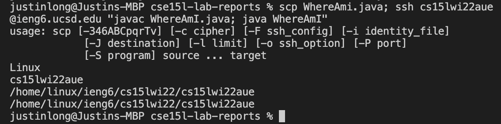
```
>[cs15lwi22lab1@congratulations]:~:94$ exit
```

**Congratulations! You have got started on your journey of CSE15L!**