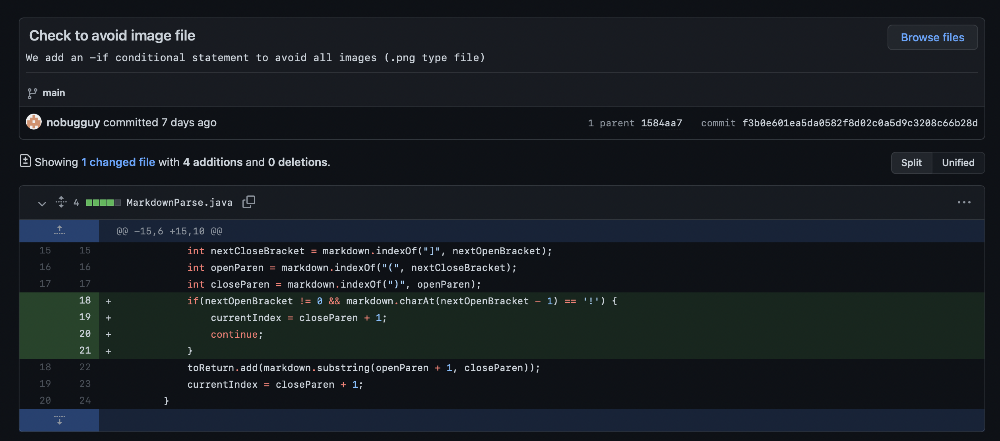
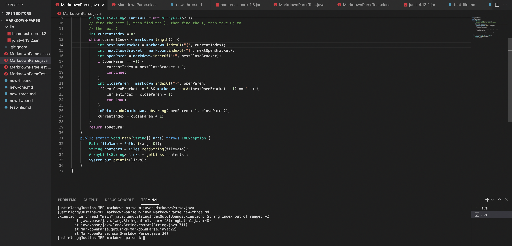

# Code Change 1


> Below is the link to the test file:
>
> [Link To Test File 1](new-file.md)

As we can see in the image below


The output of running the new-line.md the command line is:
```
[image.png, google.com]
```

This is obviously not the output we would want, because this a image output instead of the link output. 

As you can see in the screenshot below:

>  The failure inducing input is a combination of an image and a link.

```

[link](google.com)
```


> The symptom here is that the program does not give us the expected output because of the bug in the getlinks() method in MarkedownParse.java, which makes our program collect the image input when it is only supposed to get link input. 


# Code Change 2


> Below is the link to the test file:
>
> [Link To Test File 2](new-two.md)


As we can see in the image below

The output of running the new-two.md the command line is:


The process of running the new-two.md the command line is interupted by exception:
```
Exception in thread "main" java.lang.StringIndexOutOfBoundsException: begin 0, end -1, length 16
```

>  The failure inducing input is a link with out the parenthesis. 
```
[link]google.com
```

>The symptom here is that the program terminatd due to StringIndexOutOfBoundsException raised due to the bug in line 22 in the getlinks() method in MarkedownParse.java. The indexOf() method returns -1 because it couldn't find a parenthesis. As a result, the substring is from 0 to -1, which is impossible and cause the exception. 

# Code Change 3


> Below is the link to the test file:
>
> [Link To Test File 3](new-three.md)

As we can see in the image below

The output of running the new-three.md the command line is:



The process of running the new-two.md the command line is interupted by exception:
```
Exception in thread "main" java.lang.StringIndexOutOfBoundsException: String index out of range: -2
```
>  The failure inducing input is a link with out the close brackets. 
```
(google.com)
```
> The symptom here is that the program terminatd due to StringIndexOutOfBoundsException raised due to the bug in line 25 in the getlinks() method in MarkedownParse.java. The indexOf() method returns -1 because it couldn't find the next open bracket. As a result, the markdown.charAt(nextOpenBracket - 1) is essentially charAt(-2), which is illegal and causes the exception. 