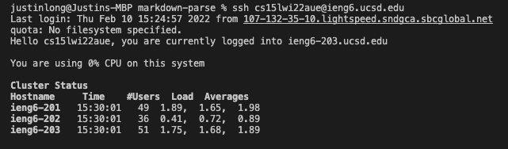
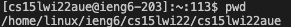
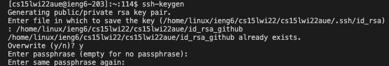
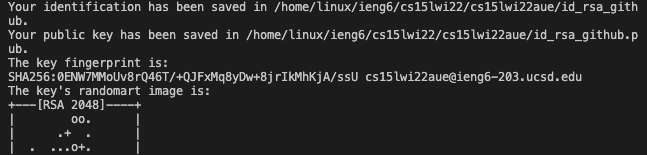
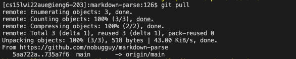
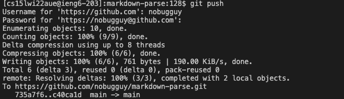

# Setup Github Access

First, we log in to the remote user account.

```
ssh cs15lwi22aue@ieng6.ucsd.edu
```



Change directory to the main directory

```
cd ~
```

Create a new location for storing public and private key
```
touch id_rsa_github
```

Go back into the main directory

```
cd ~
```

Use pwd command to print the current working directory so that we have a location for storing public and private key.

```
pwd
```
As you can see, we get the working directory:



After that, we use ssh key-gen to generate the public and private keys and store them in our user account.



As we can see, the public and private address are shown below:



Private Key Location:

```
/home/linux/ieng6/cs15lwi22/cs15lwi22aue/id_rsa_github
```

Public Key Location:

```
/home/linux/ieng6/cs15lwi22/cs15lwi22aue/id_rsa_github.pub
```

After Setting up the SSH Key, we can do git pull to sync with GitHub.



Then git push to Github.



Here is the link for the resulting commit:

[Resulting Commit](https://github.com/nobugguy/markdown-parse/commit/070b8cc449a45c015e6b2009179d780f05aed62e)