# CSE 15L Lab Report 4

Link to my markdown-parse repository:
[My MarkdownParse](https://github.com/nobugguy/markdown-parse)

Link to the markdown-parse repository reviewed by my group:
[Group Reviewed MarkdownParse](https://github.com/johnsonli010801/markdown-parse)

**Snippet 1**

1. Expected Output

```
[`google.com, "google.com, ucsd.edu]
```

2. My Test for Snippet One

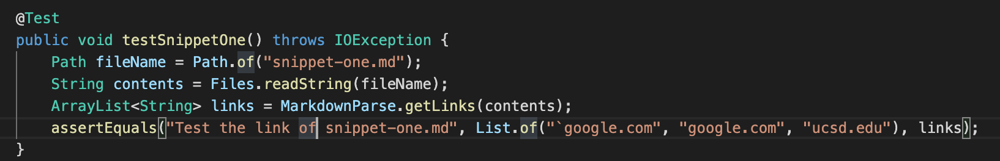

3. Test Result for my Markdownparse

> The test didn't pass.

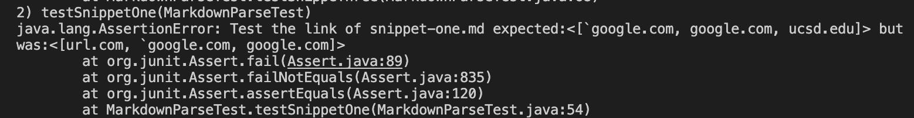

4. Test result for reviewed MarkdownParse

> The test didn't pass.

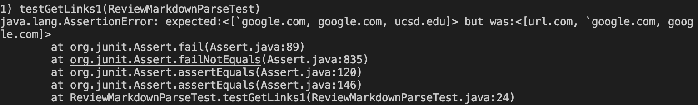


**Snippet 2**

1. Expected Output

```
[a.com, a.com(()), example.com]
```

2. My Test for Snippet 2

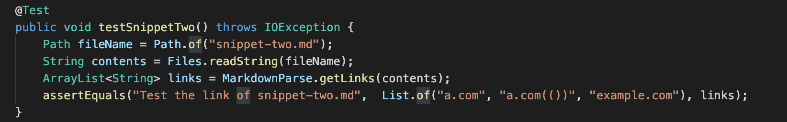

3. Test Result for my Markdownparse

> The test didn't pass.

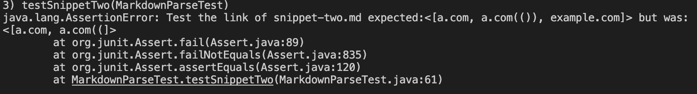

4. Test result for reviewed MarkdownParse

> The test didn't pass.

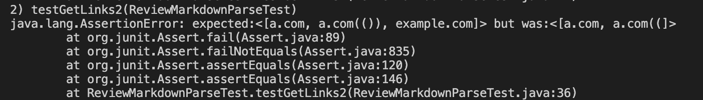


**Snippet 3**

1. Expected Output

```
[https://ucsd-cse15l-w22.github.io/]
```

2. My Test for Snippet 3

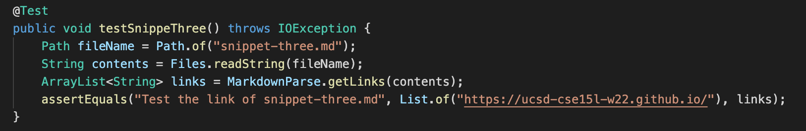

3. Test Result for my Markdownparse

> The test didn't pass.

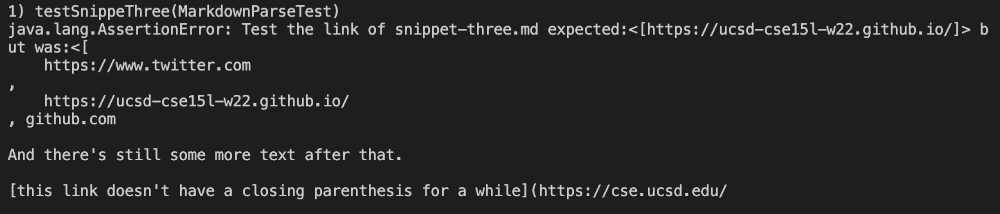

4. Test result for reviewed MarkdownParse
> The test didn't pass.

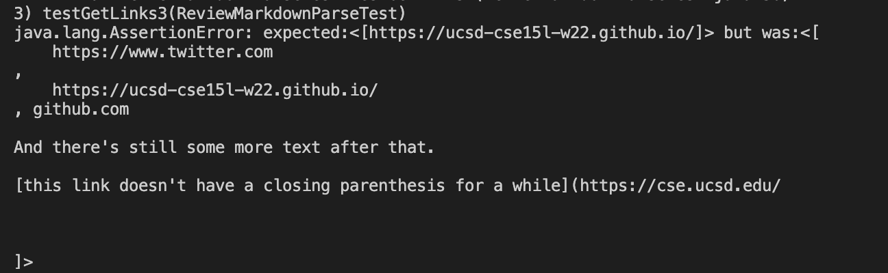

**Debug 1**

Yes, it is possible. I added a if condition at line 43 to avoid the situation that we have a "`" symbol before the first open parenthesis. This avoids the url.com to be added into the list. 

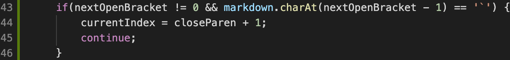

I use the if conditional to find whether "](" exist and its location instead of "]" and "(" respectively. After that, I just assign the index of "](" to nextCloseBracket. This avoid the situation where "]" in side "[]" to be classified as the actual nextCloseBracket and our link was skipped because the propgram find "]" to be seperate from ")".

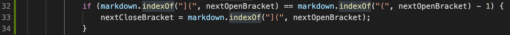

**Debug 2**

There is a significant issue with this code so that it doesn't check when the case that parens or brackets wraps arround like this: "[[[]]]", or "((()))". These situations are not handled, and handling them will cost many lines. A potential solution to this can be that we implement a stack and push every char in this kind of string in, then we pop and peek to makesure they wrap around. 

**Debug 3**

There is a significant issue with this code so that we will need to solve the problem that we have a lot of line switching between the end of the body of link and the close parenthesis. In addition, the case when a link before the link does not have close parenthesis was not handled. This will cause the program to include from the beginning of the first link to the end of the second link, causing a mess. As a result, 10 lines would be too few to fix this problem.