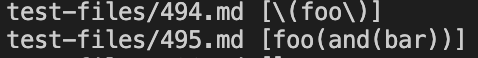
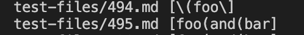
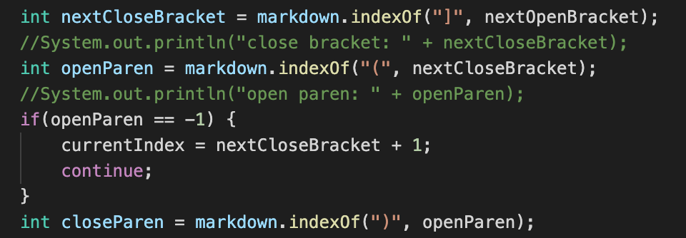

# CSE 15L Lab Report 5

I found the difference by visualizing the output both under the public implementation and my own implementation, using the following command.

```
time bash script.sh
```

**Output of public implementation:**



**Output of my own implementation:**



We found that both the test 494 and 495 have different output between two tests manually by vertically comparing all output.

**1: Test 494**

The public output is correct, which should be:

```
[\(foo\)]
```

In comparison, my output missed a close parenthesis at the end:

```
[\(foo\]
```

> My code is wrong because I don't check for the cases when the link has multiple parenthesis inside the link, which only detects the first close parenthesis it encounters and indentifies it as the actual end. 

As you can see in the following code:



Only the segment between the first open-parenthesis and the first close parenthesis was included, which caused the bug to occur.

**2: Test 495**

The public output is correct, which should be:

```
[foo(and(bar))]
```

In comparison, my output missed two close parenthesis at the end:

```
[foo(and(bar]
```
> My code is incorrect because it does not account for the circumstances where a link has several parenthesis, as it simply detects the first close parenthesis it meets and recognizes it as the end.

As you can see in the following code:


Only the segment between the first open-parenthesis and the first close parenthesis was included, which caused the bug to occur.